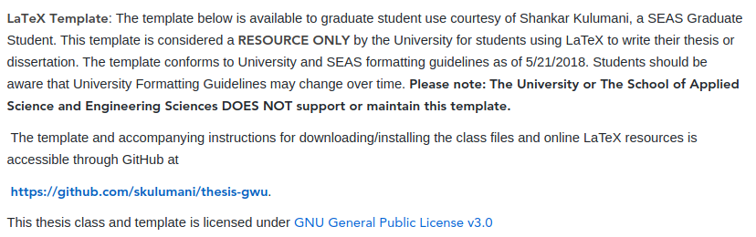

| Build Status                             | Latest Release                                      | Version                                             | Last Commit                                                     | Activity                                                      | CTAN                         | Citation |
| :--------------------------------------: | :--------------------------:                        | :----:                                              | :------:                                                        | :------:                                                      | :----:                       | :-----: |
| [![Travis][travis_shield]][travis]       | [![Github Release][release_shield]][github_release] | [![Github Version][version_shield]][github_version] | [![Github Last Commit][last_commit_shield]][github_last_commit] | [![Github commit activity][activity_shield]][github_activity] | [![CTAN][ctan_shield]][ctan] | [![DOI][ doi_shield ]][ doi ]

[travis_shield]: https://travis-ci.org/skulumani/thesis-gwu.svg?branch=master 
[release_shield]: https://img.shields.io/github/release/skulumani/thesis-gwu.svg
[version_shield]: https://badge.fury.io/gh/skulumani%2Fthesis-gwu.svg
[last_commit_shield]: https://img.shields.io/github/last-commit/skulumani/thesis-gwu.svg
[activity_shield]: https://img.shields.io/github/commit-activity/y/skulumani/thesis-gwu.svg
[ctan_shield]: https://img.shields.io/ctan/v/tex.svg
[doi_shield]: https://zenodo.org/badge/69136100.svg

[travis]: https://travis-ci.org/skulumani/thesis-gwu
[github_release]: https://github.com/skulumani/thesis-gwu/releases/latest
[github_version]: https://github.com/skulumani/thesis-gwu/releases/latest
[github_last_commit]: https://github.com/skulumani/thesis-gwu/commits/master
[github_activity]: https://github.com/skulumani/thesis-gwu/graphs/commit-activity
[ctan]: https://ctan.org/pkg/thesis-gwu
[doi]: https://zenodo.org/badge/latestdoi/69136100

## [GWU Thesis](https://skulumani.github.io/2016/10/thesis-gwu)

This is a [GWU SEAS](https://library.gwu.edu/seas) thesis template, it conforms to the University and SEAS formatting guidelines as of May 21 2018.

### Installing

You can install this thesis class in one of two ways:

1. Clone/Download this repo onto your computer, and use

~~~
\documentclass[path/to/thesis-gwu]
~~~

2. Install thesis-gwu from CTAN

~~~
tlmgr install thesis-gwu
~~~

Which will download this class file to your computer and install it appropriately. 
Any document on your machine can then use `thesis-gwu`

### Building the PDF

To build the document, it is easiest to use the great [`latexmk`](http://mg.readthedocs.io/latexmk.html) by simply running:

~~~
latexmk thesis-sample.tex
~~~

Which will automatically build and output a PDF, the latest version of which is linked [above][pdf].

## Intro to LaTeX

This is a LaTeX class file, and an example document, which demonstrates the use of `thesis-gwu.cls`. 
It is much different than a simple, easy to follow tutorial for learning how to use LaTeX.
In much the same way, one would not want to wait until the day of an exam to beginning learning new material, you as the user should avoid trying to learn something as complex as LaTeX when a deadline (thesis) is fast approaching.

If there's one piece of advice with LaTeX it is this:

**Begin early and read all you can**

You will run into issues and difficulties. 
However, you are not the first, and most definitely, not the last person to encounter the exact same issue. 
The only hope is to find a solution and try to document your process to help others who come afterwards. 

As a result, this document **DOES NOT** teach you how to use LaTeX, but rather it focuses on the usage of the class file and creating a GWU SEAS thesis. 
It is up to you to learn LaTeX. 

All that being said, this document does make it relatively easy, and here is a little more help for the uninitiated.
Most of this material comes from the very good [LaTeX Wikibook](https://en.wikibooks.org/wiki/LaTeX).

### Getting LaTeX

You can either install or use an online service.
Installing everything means you can work without being connected to the internet. 
You also have total control over the various intricacies of LaTeX as it's on your system.
This also means you have the responsibility of ensuring it's working properly, and fixing it when it goes horribly wrong.

Using and online service frees you from dealing with downloading, installing, updating, etc. 
At the same time, you also are dependent on the internet and a working website in order to write your thesis. 
If their website is compromised, crashes, gets DDoS'ed or the like, you may be in a difficult situation. 

The choice is ultimately up to you and here are some links

1. [TexLive](https://www.tug.org/texlive/)
  * This distribution runs on Linux/Unix/Windows. 
  It is my preferred choice for installation.
2. [MacTeX](https://tug.org/mactex/)
  * This distribution basically converts TeXLive to run on MacOS. 
  For all useful purposes, it works exactly like TeXLive.
3. [MikTeX](https://miktex.org/)
  * This is a Windows specific distribution.
  It has some slight differences as compared to TeXLive which may or may not matter to you.
4. [ShareLaTeX](https://www.sharelatex.com/)
  * A nice online service to allow you to compile your documents. 
  I've heard good things from friends and it seems to be preferred over the following.
5. [OverLeaf](https://www.overleaf.com/)
  * Another online LaTeX document creation service. 

### Learning LaTeX

LaTeX/TeX is a high quality document typesetting programming language. 
It was invented by [Donald Knuth](https://en.wikipedia.org/wiki/Donald_Knuth) and is the standard for creating high quality publications accurately and consistently.
The history of [LaTeX](https://en.wikipedia.org/wiki/LaTeX) is quite interesting and you might use some of your copious free time to read more about it.

There are a wide variety of resources available to learn LaTeX.
Here are some examples that I've used to learn. 
In the end, any learning process is generally difficult and time intensive. 
Again, it pays to begin early.

1. [TeXLive](https://en.wikibooks.org/wiki/LaTeX)
2. [Intro to LaTeX2e](http://tug.ctan.org/info/lshort/english/lshort.pdf)
3. [LaTeX for novices](http://www.dickimaw-books.com/latex/novices/)
4. [Solve all LaTeX problems](http://bfy.tw/8RQd)

## Usage

:exclamation: Hopefully you've used LaTeX prior to starting your dissertation. 

For the user, you only have to modify the [frontmatter](https://github.com/skulumani/thesis-gwu/blob/master/tex/frontmatter.tex) with your information. 
The class file will automatically use this data to populate the title page, copyright, committee information, etc. 

There is already logic built in to allow for commands to be removed/added at will.
For example, there are a variety of frontmatter pages, i.e. prologue, preface, and acknowledgments, while in reality you'll typically only include one of these.
Simply, by removing the command or using the macros `\hidepreface` you can automatically remove them. 

Your text can be included in individual `/tex/*.tex` files and included in the main document using `\include{./tex/chapter1.tex}`. 
This gives you the added benefit of using `\includeonly{chapter1.tex}` to compile only specific sections of your much larger thesis. 

The class file already loads several common packages such as, `amsmath, graphicx, cleveref, hyperref` and others. 
You can add more packages but be aware that all package interactions **HAVE NOT** been tested. 

There is also some demonstration of typical commands, such as equations, figures, cross-referencing. 

## Additional Tips

You can find some additional tips in [`./doc/tips.md`](./doc/tips.md)

## Dissertation examples

If you decide to use this template, feel free to send me an [email](mailto:skulumani@gwu.edu) and I can add your name/link below:

* [Farshad Nasiri](https://www.linkedin.com/in/farshad-nasiri): The Structure of turbulent a boundary layer along a vertical, surface-piercing flat plate
* [Evan Kaufman](https://www.linkedin.com/in/evan-kaufman-7333b81b)
* [Mahdis Bisheban](https://www.linkedin.com/in/mahdisbisheban)
* [Mohammed Reza Najjari](https://www.linkedin.com/in/mohammad-reza-najjari-249b2b79)

## Contributing

Feel free to contribute any comments/suggestions you may have for this thesis. 
There are already a variety of [issues](https://github.com/skulumani/thesis-gwu/issues) that anyone can contribute to help solving. 

If you have any ideas to improve this class file or want to implement some new features feel free to submit a [pull request](https://help.github.com/articles/about-pull-requests/).

Eventually, this class file can serve as a legitimate format for all GWU graduate work.

## Inspiration

This is an extension/modification of a template created for the [University of Michigan](http://www-personal.umich.edu/~dalle/codes/thesis-umich/) by Derek Dalle.
I've made some modifications and updates to replace out of date packages, and comply with GWU guidelines.

## License 

This thesis class and template are released under the [GNU General Public License v3.0](http://www.gnu.org/licenses/gpl-3.0.html) 
